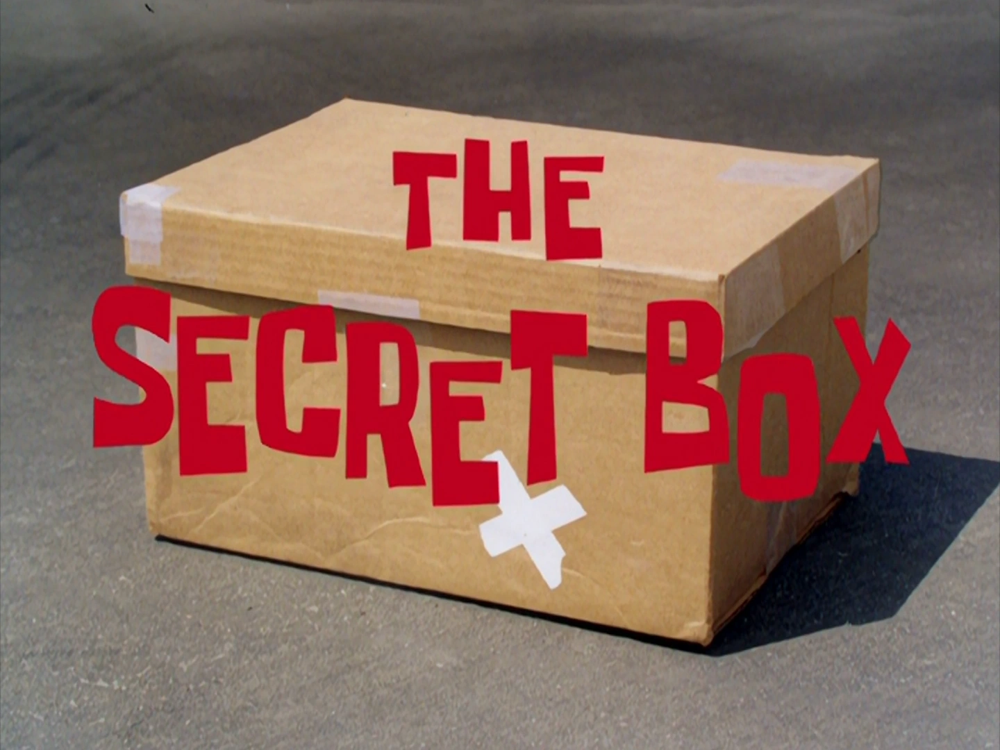

# The Secret Box




## Overview

The Secret Box is a locally controlled, offline password manager written in Python. I created it to learn more about modern encryption techniques and storage security. The project name was inspired by Patrick Star and his impenetrable [secret box](https://www.youtube.com/watch?v=n4BbMWKzYUI).

This was developed using Python `3.12.8` with the following external dependencies:
- `cryptography`: Provides cryptographic recipes and primitives for Python.
- `argon2-cffi`: Provides Argon2 password hashing via CFFI.

I also used Python's `tkinter` package to create a basic GUI.


## Security Features

| Feature                    | Description                                                     |
|----------------------------|-----------------------------------------------------------------|
| **AES-256-GCM**            | Strong encryption with built-in integrity/authentication        |
| **Argon2id**               | Memory-hard password hashing to resist brute-force attacks      |
| **No plaintext vault**     | Vault is only decrypted in memory, never saved unencrypted      |
| **Deletion phrase**        | Protects against accidental or unauthorized vault deletion      |
| **No password reset**      | Reduces attack surface and prevents social engineering          |
| **No backups**             | Data destruction is permanent                                   |
| **100% offline**           | No internet access, APIs, or cloud sync                         |
| **No networking libraries**| No use of `requests`, `socket`, etc.                            |
| **No telemetry**           | No data logging tracking, or sharing                            |
| **Local-only access**      | The vault file remains exclusively on your machine              |


## Usage

Clone the repo and install the requirements listed in `requirements.txt`.

### Option 1: Run with Python

Run the app locally:

```bash
python -m sbox.run
```

### Option 2: Build Executable (Windows OS)

Run the build script:

```bash
source scripts/build.sh
```

This creates a `bin` directory in project root with the app's executable, `sbox.exe`. You can run the executable directly or add it to your system/user `PATH` to launch via terminal by invoking the `sbox` command.

NOTE: The `build` script only supports Windows OS. Modify it as needed for macOS or Linux.


## Testing

Only functions from `sbox.core` have automated tests. The GUI was only tested manually because graphical interface testing is a bit more complex and this project was just a learning exercise.

Execute tests for `sbox.core`:
1. Install the `pytest` package.
2. Execute `pytest tests --verbose`.


## Disclaimer

This project is simply a personal learning exercise; it is not intended for production use. Use it at your own risk.

Other important notes:

- The app only works on Windows OS. You'll need to tweak `sbox/config.py` for other OS compatibility.
- Only run the app on trusted machines. Malware, keyloggers, or RAM-scraping tools can bypass all encryption. This is true even for commercial / well-known password managers.
- The app does not enforce any password requirements, like minimum length or complexity. It's up to you to choose a secure password. Here are some recommendations put forth by the CISA: https://www.cisa.gov/secure-our-world/use-strong-passwords
- When the 'vault' is unlocked, all secrets are in memory as strings. They will remain in memory until the app exits or deletes them. Ensure you close the app after use to reduce exposure. This is an unavoidable risk in any GUI password manager.
- Written entirely in Python, the app benefits from automatic garbage collection but cannot guarantee immediate zeroing of sensitive data during runtime. However, OS-level memory wiping occurs upon app termination.
